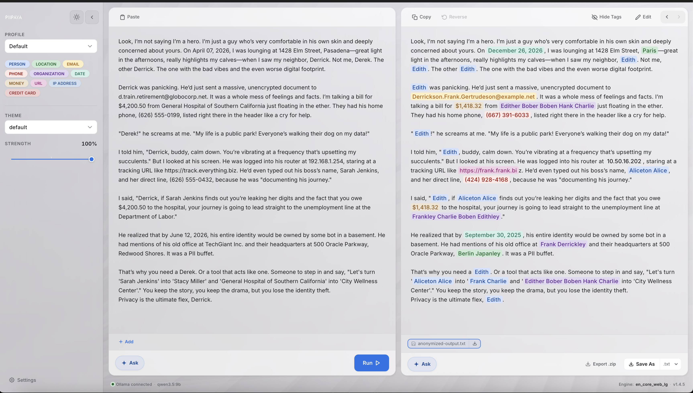

# PIIPAYA - Replace PII data with narrative coherence

Local MacOS app to remove any sensitive data from any file, keeping narrative coherence and 100% private.

<a href="https://jayf0x.github.io/PIIPAYA/">
    
</a>

> Currently only fully supporting on MacOS.

**Download**:
From [website](https://jayf0x.github.io/PIIPAYA/) or see [releases](https://github.com/jayf0x/PIIPAYA/releases).

- Might need to execute ` xattr -dr com.apple.quarantine /Applications/Piipaya.app`

Support file batching, `OCR` support for most common image types, PDF and DOCX.


## Security & Privacy
We take security seriously. Please create an issue

## Local dev
Install:
```sh
cd piipaya-desktop
# will install py env
bash piipaya-desktop/scripts/install.sh

# will build Rust sidecar
bash piipaya-desktop/scripts/build-sidecar.sh

#
bun run install
bun run dev
``